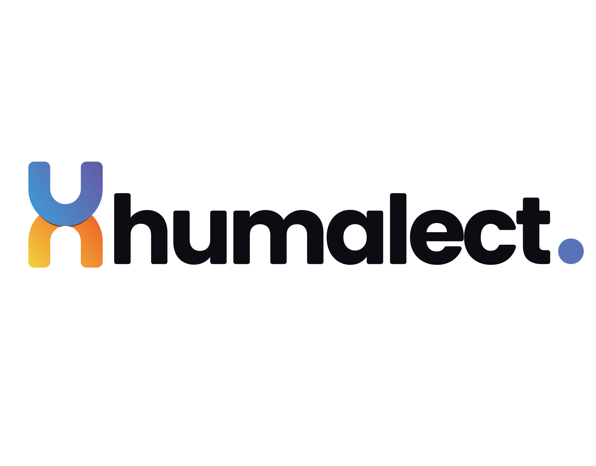

<picture>
  <source media="(prefers-color-scheme: dark)"  srcset="./assets/humalect-logo-dark.png">
  <source media="(prefers-color-scheme: light)"  srcset="./assets/humalect-logo-light.png">
  
</picture>
<h1 align= "center">Self Serve Developer Portal built on Kubernetes</h1>

Empower developers, code to deployment in minutes🚀

<a href="https://humalect.com/">Website</a>
|
<a href="https://console.humalect.com/public/user/login?demoLogin=true">Demo</a>
|
<a href="https://humalect.com/docs/">Documentation</a>
|
<a href="https://twitter.com/humalect">Twitter</a>

